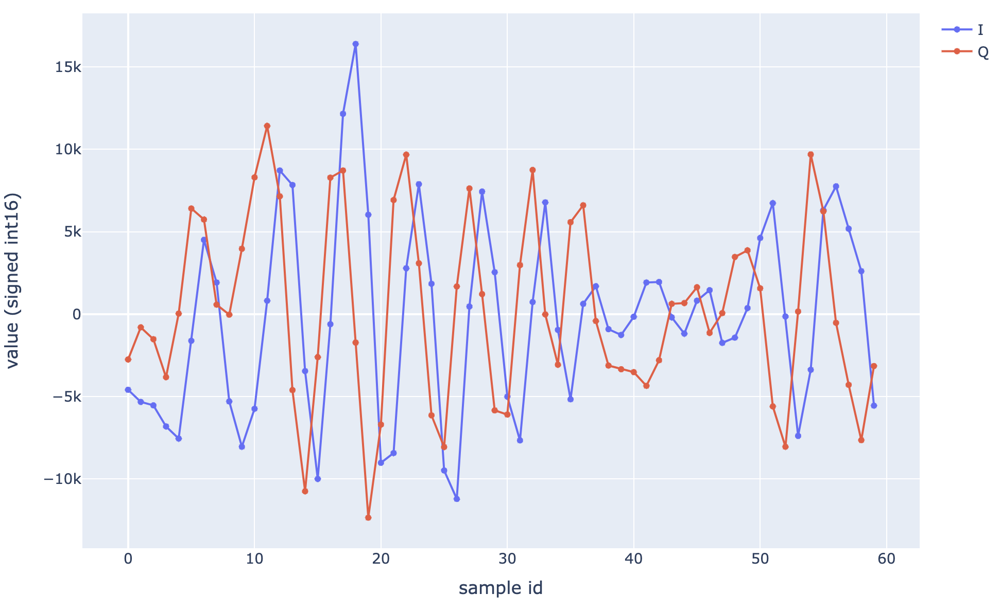

# Library for Ubertone's binary files

This library provides python scripts for the extraction of data from udt raw binary files (version 5) generated by Ubertone's UB-Lab P, UB-Lab S4, UB-SediFlow and UB-Lab 3C.
For earlier udt versions, please refer to [udt v4 library](https://github.com/ubertone/udt4_extractor)

If you don't want to write your own code, you will love our [online processing and visualisation tool](https://cloud2.ubertone.eu). We can also provide custom data processing on this cloud platform.

For general data about Ubertone's acoustic profiler, see [Ubertone's website](https://www.ubertone.com).

## Dependencies

The scripts are dependent on [NumPy](https://numpy.org) and on the [peacock_uvp_py_api library](https://github.com/ubertone/peacock_uvp_py_api).

copy or link (`ln -s XXX/peacock_uvp`) the *peacock_uvp* folder into the *udt_extractor* folder (or change the *sys.path* in *test.py*) and run `python test.py` to read the content of the *raw_test.udt* 

By default, the amount of data extracted is limited to about 50 MB (to avoid memory overload).
This value can be modified when calling *raw_extract()*.
If you handle big files, you should better rewrite *raw_extract()* code with an optimized approach. 

## User manual

Data format details are given in the [user manual](user-manual-en_udt_extractor_20231107.pdf).

IQ data can also be extracted as :

*(cell 30 of channel for at 1.7 secondes)*
See the [test.py](test.py) code for more details.

Some comments are still in french, sorry for that, we are working on the translation.

If anything is unclear after reading the document and scripts, feel free to [contact us](https://www.ubertone.com/contact.html) 